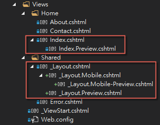

# DisplayModeMatrix

*Read this in other languages: [English](README.en-us.md), [Chinese](README.md).*

DisplayModeMatrix is used to extend the compoundability of a single dimension ASP.NET MVC Display Modes.
Inspired from Android, see [How Android Finds the Best-matching Resource](https://developer.android.com/guide/topics/resources/providing-resources.html#BestMatch)

With multiple DisplayMode dimensions, you can:

- Provide good views A/B testing approach 
- Provide customized report formatting in Multi-tenant application dead easy
- Multiple Display Modes side by side

## Basic idea

The developer could use ASP.NET MVC Display Modes to separate view for the different scenario.
A usually case study is Desktop and Mobile view separation.
While running into View. We expect the web represent views from that scenario. 

```
Index.cshtml  
Index.Mobile.cshtml  
```

Desktop runs Index.cshtml, mobile runs Index.Mobile.cshtml.

It needs a Display Modes registration to achieve.

```
DisplayModeProvider.Instance.Modes.Insert(0, new DefaultDisplayMode("Mobile")
{
    ContextCondition = (context => context.IsMobile())    
});
```

Display Modes is simple and easier to use.

But sometimes, We need more flexible Display Modes configuration. And Display Modes is just one dimension friendly. Or else you hard code much registration while application startup.

We need segments in suffix for complicated usage. You may found some articles teach implement IDisplayMode interface to achieve that.

It just much more complicated.

A basic idea is to assemble suffix from parts, and concat with a hyphen.

```
Index.{Devices}-{Preview}.cshtml
```

Each part has individual symbol and evaluation rule (expression).

- `{Device}` substitute with "Mobile", if HttpContext.Current.IsMobile()  
- `{Preview}` substitute with "Preview", if specified cookie existed  

Any part could be optional. If it is not satisfied just leave it a blank.

Useless hyphen will never generated.

And a builder pattern helps the developer to compute compositions.

## How to use

### Given a multiple optional factors, every factor has possible values

|         Factors         |                       Values                      |
|-------------------------|---------------------------------------------------|
| **Device** (optional)   | *Mobile*, *Tablet*, *Default* (empty suffix)      |
| **Theme** (optional)    | *Dark*, *Default* (empty suffix)                  |
| **Preview** (optional)  | *Preview*, *No Preview* (empty suffix)            |

### Expected factor combination and sequencing result

- Mobile-Dark-Preview
- Tablet-Dark-Preview
- Mobile-Dark
- Tablet-Dark
- Mobile-Preview
- Tablet-Preview
- Dark-Preview
- Mobile
- Tablet
- Dark
- Preview

The string of combination used to match Display Modes mechanism.

### Views structure

With combinatability. So you can organize MVC View (.cshtml) with Display Modes more flexible.



### Use the DisplayModeMatrixBuilder to create a list of Display Modes

```csharp
var builder = new DisplayModeMatrixBuilder();

var matrix = builder
                .AddOptionalFactor("Device", l => l.Evidence("Mobile", x => IsMobile(x)).Evidence("Tablet", x => IsTablet(x)))
                .AddOptionalFactor("Theme", l => l.Evidence("Dark", x => CurrentTheme(x) == "dark"))
                .AddOptionalFactor("Preview", l => l.Evidence("Preview", x => IsPreview(x)))
                .Build();
```

builder.Build() produces an computed `IEnumerable<DisplayModeProfile>` collection can be used to generate Display Modes for ASP.NET MVC. 

Please see DisplayModeMatrix.Web in [~/App_Start/DisplayModeConfig.cs](DisplayModeMatrix.Web/App_Start/DisplayModeConfig.cs)

```csharp
foreach (var profile in matrix)
{
    instance.Modes.Add(new DefaultDisplayMode(profile.Name)
    {
        ContextCondition = x => profile.ContextCondition(x)
    });
}
```

### Benchmarking

[SuperBenchmarker](https://github.com/aliostad/SuperBenchmarker) (-n 1000 -c 10)

|                     | Apply DisplayModeMatrixBuilder |     Without Display Modes     |
|---------------------|--------------------------------|-------------------------------|
| TPS                 | 133.2 (requests/second)        | 135.3 (requests/second)       |
| Max                 | 6018.8998ms                    | 6160.7143ms                   |
| Min                 | 2.4041ms                       | 2.3731ms                      |
| Avg                 | 67.8596257ms                   | 67.777162ms                   |
